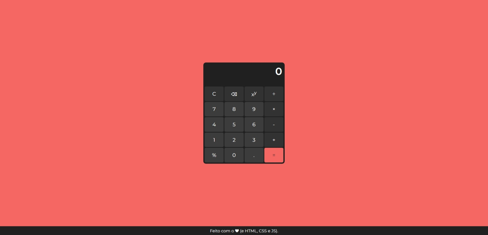

# Calculadora JS

Calculadora simples desenvolvida usando as linguagens HTML, CSS e JavaScript. Foi utilizada como base a calculadora do Windows 11.

Este projeto tem como objetivo colocar em prática os meus conhecimentos nas tecnologias citadas.

**Resultado final do projeto:**

